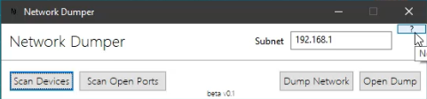
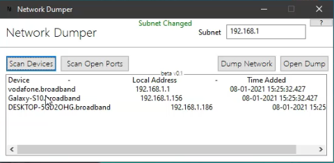

# Network-Dumper
This tool is simply a project that was made during my time at University.

The intended purpose of the tool is to scan open ports, sockets and devices on the network the tool is ran on. The information will be shown in the tool, but can be dumped to a text file that is created on your desktop. The text file will be encrypted and decrypted using a password set by the user.

The code is not up-to-scratch as this is a rough mock-up of what the final product would be like. Whether this project gets finished or not is entirely based on how much I hate Java on that current day.

You can set a custom thread value within the code to speed up the scanning process, only use what your CPU can handle. I was supposed to create an input form within the GUI to adjust the threads used, but the time for the project was up and decided to move on...I may add to it a later date, who knows. 

Use at your own risk.

## Screenshots

